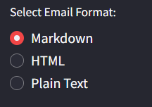

# Cold Email Generator 📧

Welcome to the **Cold Email Generator**, an interactive Streamlit application that takes a careers page URL, extracts job postings, and generates a highly customized cold email. This tool leverages AI to parse job descriptions, highlight your company's capabilities, and produce compelling outreach emails.

## Table of Contents
- [Features](#features)
- [Installation](#installation)
- [Usage](#usage)
- [Screenshots](#screenshots)
- [Technologies](#technologies)
- [Troubleshooting](#troubleshooting)
- [Contributing](#contributing)
- [License](#license)

## Features
- 📜 **URL-Based Extraction**: Input any careers page URL and let the app automatically parse job descriptions.
- 📝 **Multiple Formats**: Generate emails in Markdown, HTML, or Plain Text.
- 🎯 **Targeted Job Listings**: Control how many jobs are displayed and integrated into the email.
- 🔗 **Portfolio Integration**: Automatically fetch relevant portfolio links from ChromaDB to showcase your past work.
- ⚡ **LLM-Powered Insights**: Uses an AI model (via Groq API) to analyze job data and produce custom emails.

## Installation

1. Clone the repository:
   ```bash
   git clone https://github.com/LokeshGullapalli/Cold_Email_Generator.git
   cd Cold_Email_Generator
   
2. Navigate into the project directory:
   ```bash
   cd Cold_Email_Generator
   
3. Install the required packages:
   ```bash
   pip install -r requirements.txt
- Ensure you have a .env file containing your GROQ_API_KEY.

4. Run the Streamlit app:
   ```bash
   streamlit run app/main.py

5. Open the app in your browser:

- After running the above command, Streamlit will provide a local URL (e.g., http://localhost:8501). Open this URL in your browser to start using the app.

## Usage
- **Open the App:** Launch the app by visiting the provided URL after running streamlit run app/main.py.
- **Input URL:** Paste a careers page URL into the input field on the main page.
- **Customize Settings:** Use the sidebar to:
-- Select the email format (Markdown, HTML, Plain Text).
-- Adjust the number of job listings to display.
- **Submit and View Results:** Click "Submit" to fetch and process job data. Review the generated cold email, job listings, and linked portfolio items.

## Screenshots
- UI of the Website


- Different Features (HTML, Markdown, Plain Text)


- Sample Result


## Technologies
- **Streamlit:** For building interactive web UIs with Python.
- **Chromadb:** For vector-based storage and portfolio link retrieval.
- **LangChain / LLM:** For AI-driven parsing and email generation.
- **Python:** The main language for server-side logic and data handling.
- **Groq API:** Accessing a large language model for intelligent text analysis.

## Troubleshooting
- **Context Too Big:** If you encounter a "Context too big" error, consider breaking the input text into chunks before processing.
- **SQLite Issues:** If encountering SQLite errors with ChromaDB, ensure you’re using a supported version or switch to the DuckDB-based persistence.
- **Check Logs:** For debugging, print out raw LLM output and inspect Streamlit logs.


## License
This project is licensed under the MIT License. See the LICENSE file for details.
